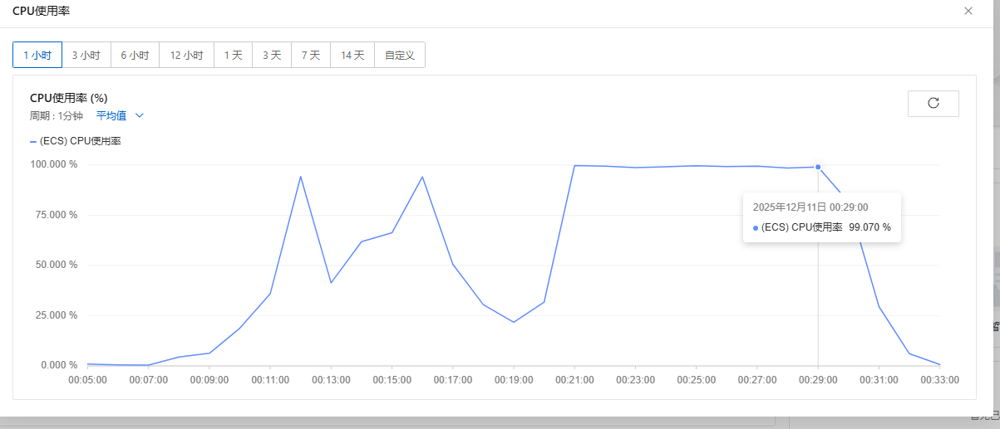

## folly 仓编译

```bash
[root@iZj6c0lg2gacwvsflk5fjlZ folly]# cloc .
    2144 text files.
    2142 unique files.
     146 files ignored.

github.com/AlDanial/cloc v 1.70  T=3.11 s (643.8 files/s, 179766.7 lines/s)
-------------------------------------------------------------------------------
Language                     files          blank        comment           code
-------------------------------------------------------------------------------
C++                            966          39595          36592         227333
C/C++ Header                   884          28981          68453         129667
Python                          36           1852           2053           7825
Markdown                        46           1853              0           6213
CMake                           43            507           1316           3668
Cython                           8            108            134            413
Assembly                         2            120            184            406
YAML                             5             16              6            375
Bourne Shell                     5             54             93            273
C                                1             17             46             77
Ruby                             1             13             26             73
DOS Batch                        1              2              0             24
make                             1             10              1             22
CSS                              1              1             15              7
-------------------------------------------------------------------------------
SUM:                          2000          73129         108919         376376
-------------------------------------------------------------------------------
[root@iZj6c0lg2gacwvsflk5fjlZ folly]# git branch
* (detached from v2022.11.14.00)
  main
```
编译Ubuntu22.04
```bash
# 前置准备
cp /etc/apt/sources.list /etc/apt/sources.list.bak
# 2. 启用 universe/multiverse 组件（Ubuntu 22.04 必需）
sudo add-apt-repository main
sudo add-apt-repository universe
sudo add-apt-repository restricted
sudo add-apt-repository multiverse

# 3. 更新软件源缓存（关键步骤，修复“无法定位包”的核心）
sudo apt update -y

# 安装 OpenSSL 开发库和二进制工具
sudo apt install -y libssl-dev openssl --reinstall

# 验证 OpenSSL 版本（确保 ≥1.1.1）
openssl version
# 正常输出示例：OpenSSL 3.0.2 15 Mar 2022 (Library: OpenSSL 3.0.2 15 Mar 2022)

```

```bash
# Clone the repo
git clone https://github.com/facebook/folly
cd folly
# Build, using system dependencies if available
python3 ./build/fbcode_builder/getdeps.py --allow-system-packages build

```

23:38开始构建

23:46进度：[371/1044] Building CXX object CMakeFiles/algorithm_simd_movemask_test.dir/folly/algorithm/simd/test/MovemaskTest.cpp.o

22:51：2U 4G x86机器崩溃退出，交换区内存不足导致


8U16G x86机器，00:10开始编译，00:30完成编译



## wangle构建

v2022.11.14.00 核心C++代码1.2w行，头文件7k
编译存在大量的外部依赖，比如boost库

```bash

[root@iZj6c0lg2gacwvsflk5fjlZ wangle]# cloc .
     360 text files.
     359 unique files.
     114 files ignored.

github.com/AlDanial/cloc v 1.70  T=0.41 s (609.8 files/s, 108611.9 lines/s)
-------------------------------------------------------------------------------
Language                     files          blank        comment           code
-------------------------------------------------------------------------------
C++                             82           2325           2253          12744
C/C++ Header                   107           2069           4360           7910
Python                          23           1329           1424           5961
CMake                           25            262            801           1753
Markdown                         7            191              0            439
YAML                             4             11              4            377
C                                1             17             46             77
-------------------------------------------------------------------------------
SUM:                           249           6204           8888          29261
-------------------------------------------------------------------------------
[root@iZj6c0lg2gacwvsflk5fjlZ wangle]# git branch
* (detached from v2022.11.14.00)
  main
[root@iZj6c0lg2gacwvsflk5fjlZ wangle]#
```
构建

```bash
python3 build/fbcode_builder/getdeps.py build wangle

```
中间有zlib和boost库原来的源码下载链接失效，导致当前无法编译，需要修改mainfest里的下载地址和sha256值
00:57开始构建
1157610e2d2412bb4ad193a35edcb85f337e18c2008bdef56680203f2a86d694  boost-1.78.0.tar.gz


## fbthrift构建

v2022.11.14.00 核心C++代码量33万行，头文件26万行

```bash

[root@iZj6c0lg2gacwvsflk5fjlZ fbthrift]# cloc .
    9770 text files.
    8077 unique files.
    3273 files ignored.

github.com/AlDanial/cloc v 1.70  T=14.75 s (440.9 files/s, 126425.1 lines/s)
--------------------------------------------------------------------------------
Language                      files          blank        comment           code
--------------------------------------------------------------------------------
C++                            1283          47269          27096         335066
Java                           1445          54200          26700         324324
C/C++ Header                   1725          50581          35365         269333
PHP                             214          17107          16782         127818
Python                          442          20616          12688         114159
Cython                          351          15136           3515          89420
Rust                            116           8935           4446          80978
Go                              172          12213           4326          79703
JSON                            153            120              0          42876
Mustache                        454           4422           3291          21647
CMake                            42            409           1144           3035
Markdown                         66           1186              0           2877
Objective C                       7            274             73           1835
JavaScript                        9             47            133           1011
YAML                              4             12              3            373
Lisp                              1             25             78            270
Ruby                              1             25             20            194
Protocol Buffers                  1             17             15            174
CSS                               5             20             54            115
C                                 1             17             46             77
Ant                               1             20             17             75
Bourne Shell                      4             22             69             69
Maven                             1              4              0             52
Bourne Again Shell                2              6              4             40
vim script                        1             12             42             38
--------------------------------------------------------------------------------
SUM:                           6501         232695         135907        1495559
--------------------------------------------------------------------------------

```
